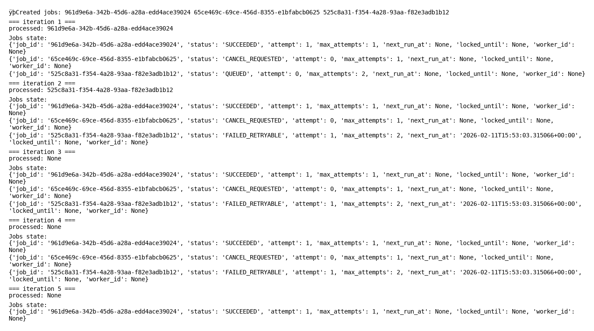
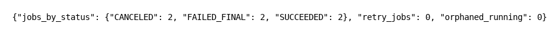

# JobManage — overview

JobManage is a job orchestration system: an API that creates jobs and a worker that executes them from a database-backed queue.

What this project demonstrates:
- idempotency (`Idempotency-Key`)
- lease-based concurrency control (worker reserves via a time-bound lock)
- retry/backoff with jitter + best-effort cancellation
- basic operability signals (`/health`, `/ready`, `/metrics`)

## Program flow

Simplified flow (plain text to avoid renderer issues):

Client -> POST /jobs -> API -> insert job row -> DB

Worker (poll + reserve/lease) -> DB -> update status/result

API -> GET /health /ready /metrics -> Operability

Worker -> structured logs -> Operability

## Docs

- Run guide (Windows/Linux): [docs/RUN.md](docs/RUN.md)
- Tech hub: [docs/README-TECH.md](docs/README-TECH.md) (EN) · [docs/README-TECH.pt-BR.md](docs/README-TECH.pt-BR.md) (PT-BR)
- API contract: [docs/API_CONTRACT.md](docs/API_CONTRACT.md)
- Ops runbook: [docs/OP_RUNBOOK.md](docs/OP_RUNBOOK.md)
- Evidence gallery: [docs/artifacts/GALLERY.md](docs/artifacts/GALLERY.md)
- Decisions/ADRs: [docs/DECISIONS.md](docs/DECISIONS.md)

## Repository layout

- `src/jobmanager/`: application code
  - `api/`: FastAPI app and HTTP handlers
  - `storage/`: DB access + job reservation/lease logic
  - `worker/`: worker loop (`run`, `run_once`) and execution behavior
  - `schemas/`: Pydantic models
- `tests/`:
  - `unit/jobmanager/`: unit tests mirroring `src/jobmanager/` modules
  - `unit/scripts/`: tests for `scripts/` helpers
  - `integration/` and `e2e/`: higher-level tests
- `scripts/`: local helpers (demo, artifacts generation, CI scan helpers)
- `docs/`: contracts, runbook, diagrams, and a small evidence gallery

## Run (preview)

Detailed steps and variants: [docs/RUN.md](docs/RUN.md)

API (Windows / PowerShell):

```powershell
python -m venv .venv
.venv\Scripts\Activate.ps1
python -m pip install -e '.[dev]'
python -m uvicorn jobmanager.api.app:app --reload --port 8000
```

Worker (separate terminal):

```powershell
.venv\Scripts\Activate.ps1
python -c "from jobmanager.worker.runner import run; run(worker_id='worker-1', poll_interval=1.0)"
```

<details>
<summary>Preview (3 screenshots)</summary>






</details>

License: MIT — [LICENSE](LICENSE)
