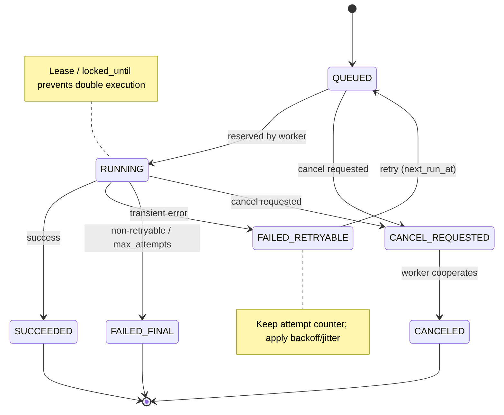

## Job lifecycle (state machine)

```mermaid
stateDiagram-v2
    [*] --> QUEUED
    QUEUED --> RUNNING: reserved by worker
    RUNNING --> SUCCEEDED: success
    RUNNING --> FAILED_RETRYABLE: transient error
    FAILED_RETRYABLE --> QUEUED: retry (next_run_at)
    RUNNING --> FAILED_FINAL: non-retryable / max_attempts
    QUEUED --> CANCEL_REQUESTED: cancel requested
    RUNNING --> CANCEL_REQUESTED: cancel requested
    CANCEL_REQUESTED --> CANCELED: worker cooperates
    FAILED_FINAL --> [*]
    SUCCEEDED --> [*]
    CANCELED --> [*]

    note right of FAILED_RETRYABLE
      Keep attempt counter; apply backoff/jitter
    end note

    note left of RUNNING
      Lease / locked_until prevents double execution
    end note
```
