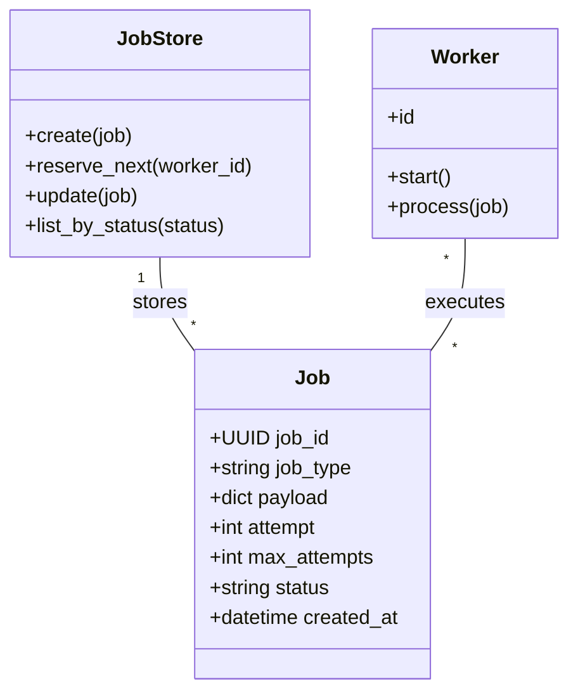
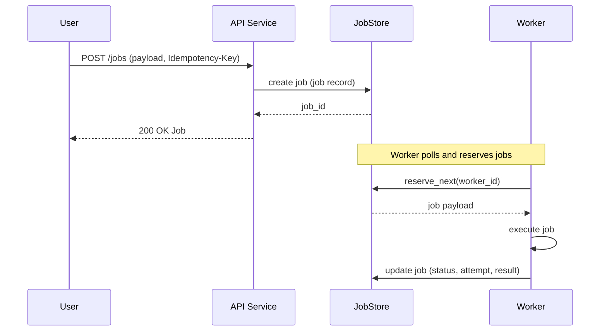

## UML templates (class + sequence)

```mermaid
classDiagram
    class Job {
      +UUID job_id
      +string job_type
      +dict payload
      +int attempt
      +int max_attempts
      +string status
      +datetime created_at
    }

    class JobStore {
      +create(job)
      +reserve_next(worker_id)
      +update(job)
      +list_by_status(status)
    }

    class Worker {
      +id
      +start()
      +process(job)
    }

    JobStore "1" -- "*" Job : stores
    Worker "*" -- "*" Job : executes

```

```mermaid
sequenceDiagram
    participant U as User
    participant API as API Service
    participant DB as JobStore
    participant W as Worker

    U->>API: POST /jobs (payload, Idempotency-Key)
    API->>DB: create job (job record)
    DB-->>API: job_id
    API-->>U: 200 OK Job

    Note over DB,W: Worker polls and reserves jobs
    W->>DB: reserve_next(worker_id)
    DB-->>W: job payload
    W->>W: execute job
    W->>DB: update job (status, attempt, result)

```
