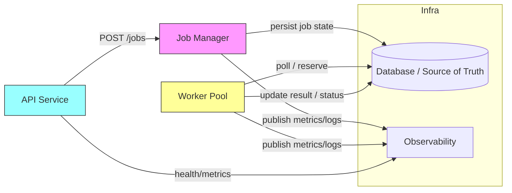

## Conceptual architecture

```mermaid
flowchart LR
  A[API Service] -->|POST /jobs| B[Job Manager]
  B -->|persist job state| D[(Database / Source of Truth)]
  C[Worker Pool] -->|poll / reserve| D
  C -->|update result / status| D
  B -->|publish metrics/logs| E[Observability]
  C -->|publish metrics/logs| E
  A -->|health/metrics| E
  subgraph Infra
    D
    E
  end
  style B fill:#f9f,stroke:#333,stroke-width:1px
  style C fill:#ff9,stroke:#333,stroke-width:1px
  style A fill:#9ff,stroke:#333,stroke-width:1px
```
